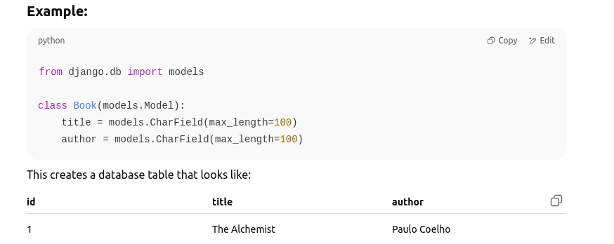
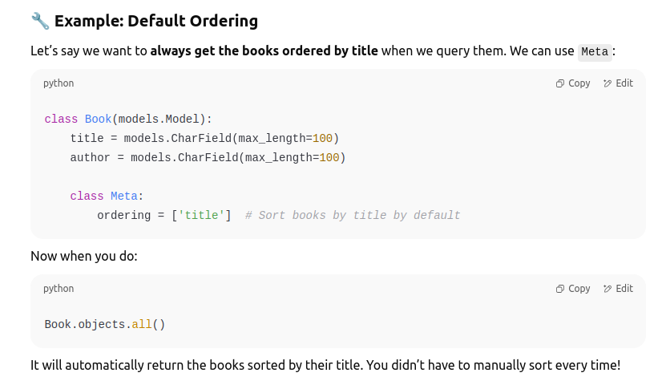
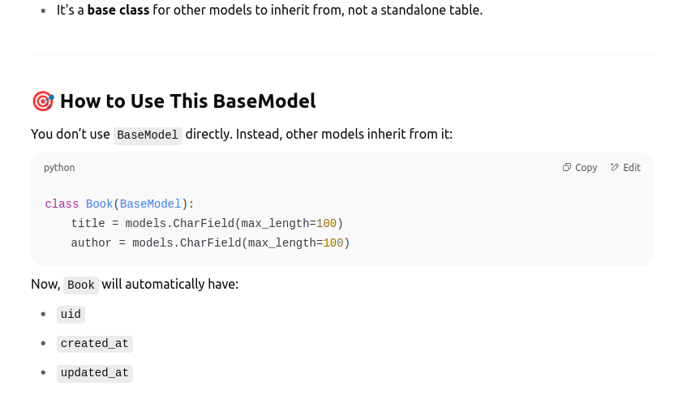

🧠  Section 1

What is a Django Model?

A Django model is a Python class that represents a table in your database. Each attribute (like name, age, or price) in the class becomes a column in the table.

Why do we use the Meta class?

Sometimes, we want to give extra instructions to Django about how this model should behave.
We put these instructions inside a special inner class called Meta. Think of Meta as a place for settings/configurations for your model.

section - 1A
